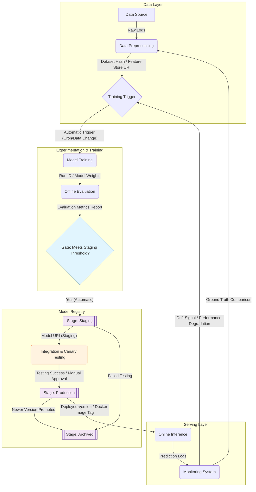

# NorthStar Logistics - ETA Model Lifecycle

## Description of Transitions and Artifacts

| Transition | Type | Artifact(s) |
| :--- | :--- | :--- |
| Data Preprocessing -> Training | Automatic | **Dataset Hash**, **Feature Store URI** |
| Model Training -> Evaluation | Automatic | **Run ID**, **Model Weights (Artifact URI)** |
| Evaluation -> Staging | **Automatic** | **Evaluation Metrics Report** |
| Staging -> Production | **Manual (Data Scientist / ML Lead)** | **Model URI (Staging)**, **Canary Test Results** |
| Production -> Serving | Automatic | **Docker Image Tag**, **Deployed Version ID** |
| Monitoring -> Training | Automatic | **Drift Signal (KS Test P-value < 0.05)** |
| Monitoring -> Data | Automatic | **Prediction Error / Ground Truth (Feedback Loop)** |
